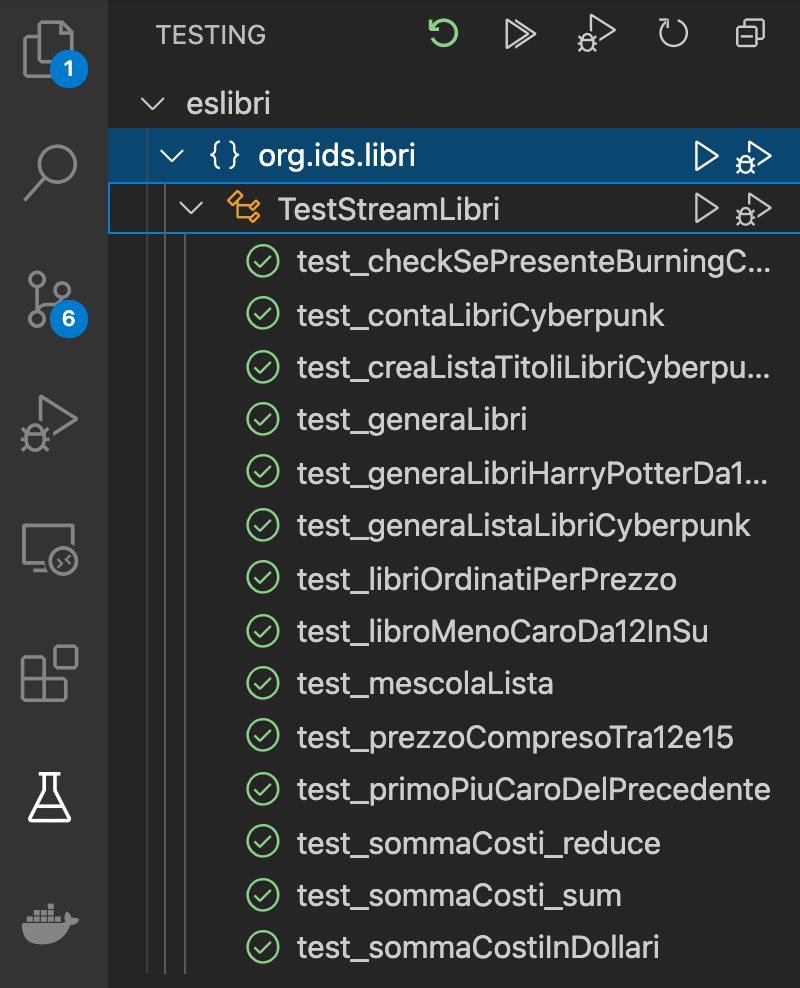

# Java 8 Streams: Esercizi su Stream di Libri

I test sono scritti con *JUnit*, completi di asserzioni scritte con *AssertJ*, una libreria molto usata per scrivere asserzioni complesse con uno stile fluent.

Il progetto *Maven* contiene:

- *Libro*: una semplice classe usata per gli esercizi sugli stream: ogni libro è caratterizzato da un titolo, un costo e una categoria;

- *Libreria*: una classe composta da metodi statici usata per generare dei libri di vario genere. La generazione avviene in maniera deterministica (non viene usato random()) in modo da permettere di scrivere test con esito prevedibile.

- *TestStreamLibri*: file di test in cui viene verificata la correttezza della soluzione agli esercizi;

- *StreamLibri*: file con i metodi da implementare per lo svolgimento degli esercizi.

## Esecuzione dei test
Si può usare maven (`mvn test`) o più semplicemente si può usare il supporto all'esecuzione dei test fornito dall'IDE. Ad esempio, in VS Code, nella bassa laterale di sinistra è possibile richiamare la colonna "Test" in cui è possibile eseguire tutti i test. I test possono anche essere eseguiti singolarmente.

Il codice con la soluzione si trova già nel repository. Per vederlo basta fare un checkout del tag "soluzione". La differenza tra un branch e un tag è che il tag è *fisso*, non può essere spostato come invece accade per il branch.

